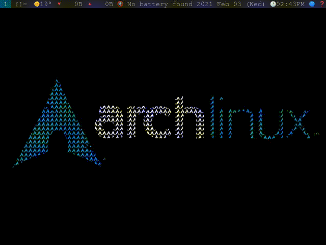

# webmenu

[](https://github.com/wbunting/webmenu/blob/master/LICENSE)

A dmenu like program for generating a menu of options from a list of html elements and writing the output to standard out. 



<!-- toc -->

- [What is this?](#what-is-this)
- [Why is this useful?](#why-is-this-useful)
- [Installation](#installation)
- [Usage](#usage)
- [Recipies](#recipies)
- [Development](#development)
- [Philosophy](#philosophy)

## What is this?

webmenu is a command line application that takes an html file of `li` tags and renders them in a simple webview. It is extremely light-weight and can replace the need to use a web browser for certain tasks. The "hello world" of this application is something like the following:

```bash
echo "<li output="hello">Hello</li><li output="world">World</li>" | xargs -I{} webmenu -s "{}"
```

This will prompt the use to select either "Hello" or "World" and upon selection write the `output` tag to standard out.


## Why is this useful?

While useless by itself, it is useful in the same way that [dmenu](https://tools.suckless.org/dmenu/) is useful for adding simple interactivity to applications. webmenu seeks to do the same but while allowing for a bit more flexibility in terms of styling the menu items, and handle more complex input than just lines of standard input. 

A common pipeline that uses webmenu might be to:
1. curl a resource from the web (not executing javascript in the process)
2. pipe the response into a formatter that generates the options for webmenu
3. pipe to webmenu
4. take the ouput of webmenu and redirect it to an application intended for viewing that output. Eg. mpv for video, a terminal for text pages, a browser for complex pages etc.

For example, if you use a command line search engine like [ddgr](https://github.com/jarun/ddgr) the results are returned in such a way that if you directly pipe them into a dmenu you will be prompted with options for the descriptions instead of only the titles of the results. And selection of an option will not output the url (instead it will output the document title of the result). 

To see how webmenu can be of more use here consider this one-liner search example:

```bash
echo "" | 
dmenu -i -p "Search" | 
xargs -I{} ddgr -np "{}" | 
ddgr-to-html | 
xargs -0 -I{} webmenu -s "{}" |
xargs -I{} $BROWSER "{}"
```

Now the job is only to fill in the data transformation step which you could do via whatever method you please! Here's a trivial transformation with Node.js which we can convert to a binary using [pkg](https://github.com/vercel/pkg):

```js
// ddgr-to-html.js
let input_stdin = "";

const stdin = process.openStdin();

stdin.on("data", (data) => {
  input_stdin += data;
});
stdin.on("end", () => {
  main();
  process.exit();
});

const main = () => {
  const jsonData = JSON.parse(input_stdin);
  const html = jsonData
    .map(
      ({
        abstract,
        title,
        url,
      }) => `<li output="${url}">
          <div class="flex items-center">
            <div class="">
              <h2 class="font-bold text-lg">${title}</h2>
              <p class="text-sm">${abstract}</p>
            </div>
          </div>
        </li>`
    )
    .join("");
  console.log(html);
};
```

The result is a simple pipeline for searching for data, browsing the results in whatever UI you like and then pointing to the results. You do all of this without ever visiting a website directly.

It is also nice to bind scripts like this to a hotkey so that you can easily search for things without ever leaving the keyboard. 

## Installation

### Pre-built binaries

Check the releases page for your operating system (only Linux for now...).

### From Source

To compile from source, first clone the repository. You will need Rust and Node installed on your system. Then run:

```bash
cargo add tauri-bundler && yarn install && yarn tauri build
```

This will create the binaries for your operating system in: `./src-tauri/release/target/`


## Usage

Construct a simple html file containing li elements that you would like the user to select from. 

```html
<!-- items.html -->
<li output="first">First</li>
<li output="second">Second</li>
<li output="third">Third</li>
```


Run `webmenu` and pass the `items.html` as an argument.

```bash
webmenu -s items.html
```

After the user selects a choice the `output` attribute will be written to standard output. 

### Styling

Styling now is all done via [tailwindcss](https://tailwindcss.com/) tags. The benefit in this particular case is that there is no extra style file or `<style>` tag necessary for rendering the list elements. 

Two things we will probably support in the future:
- An external CSS file as a command line argument
- Respecting GTK theme / xrdb colors. 


## Recipies

A few of the scripts used here can be found in the scripts directory of the repository. For the helper utilities you'll have to compile them yourself with [pkg](https://github.com/vercel/pkg) at the moment, but projects can be made of them if there is enough interest.

### Search menu
```bash
#!/bin/sh
# scripts/ddgr
echo "" | 
dmenu -i -p "Search" | 
xargs -I{} ddgr -np "{}" | 
ddgr-to-html | 
xargs -0 -I{} webmenu -s "{}" |
xargs -I{} $BROWSER "{}"
```

See above for an implementation of ddgr-to-html in Node.js. You can find it in the scripts folder of this repository. You could even pipe the result to a program switcher depending on the url -- if say you wanted to open videos in mpv. 

### Video watching menu

```bash
#!/bin/sh
# scripts/youtube-search

# prompt search
search_query=$(echo "" | 
dmenu -i -p "🔎 Search" |
# url encode spaces
sed 's/ /+/g')

notify-send "Searching..."

# curl down the yotube search page
curl -L "https://youtube.com/results?search_query=$search_query" |
# extract the initial data and manipulate it to json
sed -n '/var ytInitialData/,/};/p' |
head -n 1 |
grep -oP '(?<=var ytInitialData = ).*}(?=;)' > /tmp/yts-search.json


url=$(cat /tmp/yts-search.json |
# the JSON from youtube contains a bunch of things we don't need so just remove those 
simplify-youtube-json |
# take the json and make some li elements to show in webmenu
youtube-json-renderer | 
# prompt the webmenu
xargs -0 -I{} webmenu -s '{}')

notify-send "Loading video..."

# show the result in mpv
mpv --ytdl-format="bestvideo[height<=?720][fps<=?30][ext=webm]+bestaudio/best" "$url"
```

## Development

For reasons unknown to me at the moment it looks like the Tauri dev server doesn't accept CLI arguments. So to develop you'll need to modify the frontend code with a manual input of list elements instead of getting it from the CLI arguments. 

Then you need two run two servers the frontend and Tauri.

## Philosophy

- Browsers should not be the only (or even primary?) way of interfacing with the web. They are good for some things, but require a lot of system resources to run and are easy attack vectors for malicious code.
- Web users should not have to run nonfree javascript in browsers to do basic navigation


### Why HTML?

Our core uses Rust for the messaging between the binary and the webview, we could have easily used some binding to produce list UI in GTK etc, but this is much harder for end users to learn. HTML is widely known and inherently secure as just a markup language (except for the `<script>` tag). 

### Why Webview?

We want to render HTML on the users's system. There are a lot of ways to do this (could use a browser etc.), but Webview is one of the lighest weight ways to do this and avoids the bloat of Electron.  

### Why Taliwindcss?

Tailwind essentially IS just plain CSS, but it ends up with easier to maintain code due to not having to come up with your own classnames for everything, while still respecting the cascade. If you didn't realize naming things is hard. 

### Why Svelte?

No reason -- it's somewhat minimal and easy to set up -- eventually we can probably deprecate Svelte for a more simple templating engine written on the Rust side, although Svelte being a compiler probably removing it will not reduce the amount of javascript that we actually run in the webview (which is used for navigation, mounting the options to the DOM etc.).

### Why Tauri?

Very easy to get started, and comes with webview which we need. But, as with Svelte, it's probably not critical to the architecture and is a candidate for being replaced with just streaming html and our injected js directly to webview via the webview crate. 
